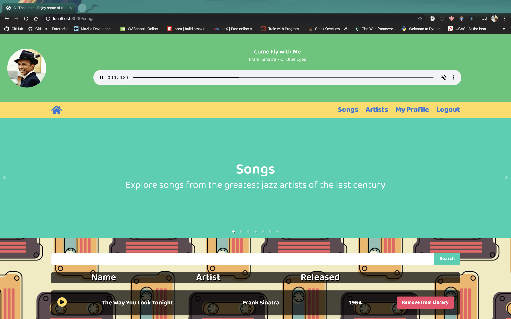
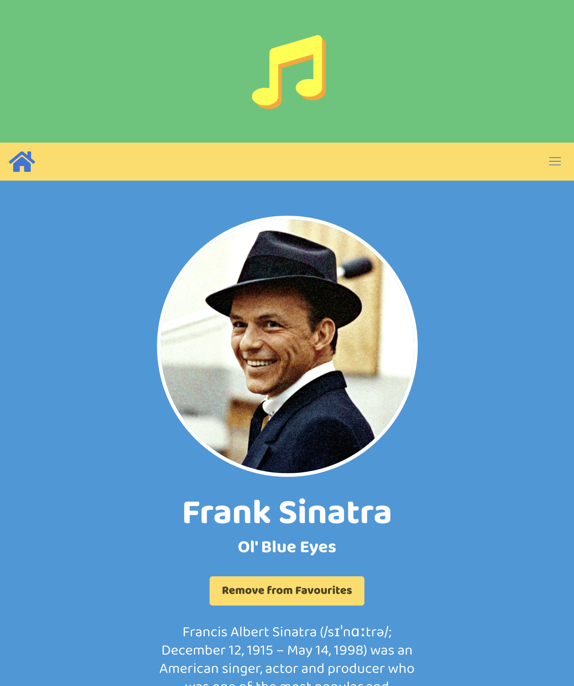
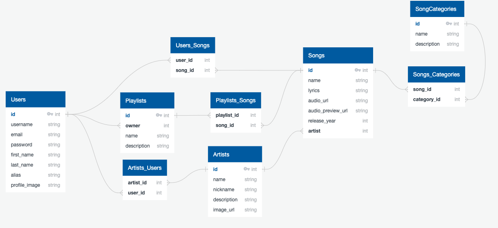

# All That Jazz (Fullstack Django App)
All That Jazz is an online music streaming service specifically for jazz lovers. Enjoy golden hits from the golden age of jazz from artists such as Sinatra, Fitzgerald, Simone, Count Basie and more. This is a fullstack web application built with Django, PostgreSQL and ReactJS.

## Getting Started
### Installation
- Clone this repository by running the terminal command `git clone git@github.com:bheki-maenetja/all-that-jazz.git`
- In the root folder run the terminal command `pipenv shell`
- In the root folder run the terminal command `pipenv install` to install all necessary packages and modules for the backend
- Navigate to the folder called frontend and run ther terminal command `yarn` to install all necessary packages and modules for the frontend
- To view the site locally run the terminal command `python manage.py runserver` and navigate to localhost:8000 in your web browser

### Deployment
- You can view a deployed version of the site [here](https://all-that-jazz-3c12c7e3c70f.herokuapp.com/)

## Technologies Used
- Python 3
- Django
- PostgreSQL
- React
- JavaScript (ES6)
- HTML 5
- SCSS/SASS
- Bulma CSS Framework
- Yarn
- Axios
* Third-party APIs
  * [DeezerAPI](https://developers.deezer.com/api)

## Overview
This project is a music streaming service with a particular focus on music from the classic jazz era. Users can listen to a plethora of great hits and create playlists of their favourites. Additionally, users can follow their favourite artists and learn more about them on their bio page.

<figcaption>Home Page</figcaption>


<figcaption>User's can listen to a plethora of great jazz hits</figcaption>


<figcaption>User's can learn more about their favourite artists on their respective bio pages</figcaption>


## Development
This project is a fullstack web application. The backend consists of a PostgreSQL database hosted on a Django server. The frontend was built using React.js and styled with CSS 3 and the Bulma CSS framework.

### The Backend
- The backend is comprised of a PostgreSQL database hosted on a Django server. The server-side language used for all backend functionality is python. There are 5 models in the database. These models are stored within 4 django apps: artists, playlists, songs and jwt_auth.

<figcaption>The Entity Relationship Diagram (ERD) for the Database</figcaption>


### Songs
- Though the information for songs (lyrics, release year etc.) is stored in the database, the actual audio files themselves are hosted on a cloud server. When users play a song the link to the file in the server is passed to the audio player.
- All songs have a preview. This is a 30-second segment of the song that is played if the user wishes to get a taste of the tune but has not added it to their library. Instead of files hosted on a server, song previews are retrieved using [DeezerAPI](https://developers.deezer.com/api).
- Songs have a many-to-many relationship with users and a many-to-one relationship with artists. In hindsight, this a drawback given the fact some songs can feature more than one artist.

### The Audio Handler
- Despite being a music streaming service this app only uses one audio player. This a React component that sits at the top of the app's page structure, adjacent to the Navbar and BrowserRouter.
- The component takes 4 props: a boolean to indicate if a song is playing, an object representing the song that is to be played, a callback function that is invoked when the song ends and another boolean that indicates whether or not the song is a preview; if true, only a 30 second segment of the song will be played.

```
// The Audio Handler

import React from 'react'
import ReactPlayer from 'react-player'

const AudioHandler = ({ isSongPlaying, currentSong, endSong, isPreview }) => (
  <>
  <div className="hero is-success">
    <div className="hero-body has-text-centered">
      {isSongPlaying ?
      <>  
      <div className="media">
        <figure className="media-left image is-128x128">
          
        </figure>
        <div className="media-content">
          <h1 className="title is-5 has-text-centered">{currentSong.name}</h1>
          <h2 className="subtitle is-6 has-text-centered">{currentSong.artist.name} - {currentSong.artist.nickname}</h2>
          <div className="container has-text-centered" style={{ display: 'flex', justifyContent: 'center' }}>
            <ReactPlayer 
              url={isPreview ? currentSong.audio_preview_url : currentSong.audio_url}
              controls={true}
              height="50px"
              width="90%"
              onEnded={endSong}
              playing={true}
            />
          </div>
        </div>
      </div>
      </>
      :
      <>
      <div className="container">
        <div className="title is-1 has-text-centered">
          <i className="fas fa-music fa-2x animated pulse faster" style={{ color: 'yellow', textShadow: '5px 5px orange', animationIterationCount: 'infinite' }}></i>
        </div>
      </div>
      </>
      }
    </div>
  </div>
  </>
)
  


export default AudioHandler
```

## Reflection
### Challenges
- **Audio Handling:** the main challenge for this project was the management of audio. Specifically, it was the issue of allowing users to listen to music whilst navigating through different parts of the website. Each time a user moved to a different page the song would stop playing. After trying (and failing) to implement a solution in which every page had an audio player and the song object would be passed from player to player, I realised that the audio player needed to sit at the top of the app's page structure. This solved the ssue and meant only one audio player was needed for the whole app.  

### Room for Improvement
- **Design & Styling:** though the app works fine on larger viewports, it is not yet ready for a mobile experience. In addition to that, I feel that the design aesthetic needs a less bright and more consistent colour scheme.
- **Playing Songs:** at present, users can only play one song at a time. It would be preferable if users could play one song after the other in their library without having to manually press play on each one. This can be achieved by passing an array of song objects to the audio handler as opposed to just one.

## Future Features
- **Advanced Search:** users can only search for songs by name or category. This will be extended so that users can search for songs by artist. Additionally, all songs belonging to an artist will be displayed on their bio page.
- **Lyrics:** even though the lyrics for each song are stored in the database, they are not put to use on the frontend of the app. In the future, users will be able to play their favourite songs and sing along to the lyrics in karaoke-style fashion.
